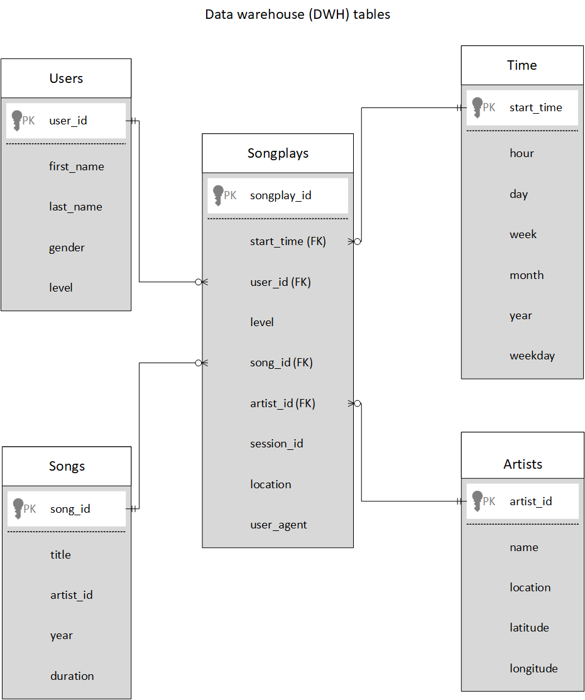

# Purpose:

A music streaming startup, **Sparkify**, has grown their user base and song database and want to move their processes and data onto the cloud. Their data resides in S3, in a directory of JSON logs on user activity on the app, as well as a directory with JSON metadata on the songs in their app.

The purpose of this project is to extract data from S3, stage them in Redshift, and transform data into a set of dimensional tables so that the analytics team can query and analyze the data.

## Datasets:

The following two datasets that reside in S3 are used:

**Song dataset**:
Dataset contains metadata about a song and the artist of that song. Each file is in JSON format. The files are partitioned by the first three letters of each song's track ID.

***Location***: s3://udacity-dend/song_data

***Sample record from a file https://udacity-dend.s3.us-west-2.amazonaws.com/song_data/A/A/A/TRAAAAK128F9318786.json***:

{"artist_id":"ARJNIUY12298900C91","artist_latitude":null,"artist_location":"","artist_longitude":null,"artist_name":"Adelitas Way","duration":213.9424,"num_songs":1,"song_id":"SOBLFFE12AF72AA5BA","title":"Scream","year":2009}

**Log Dataset**:
Dataset consists of log files generated by the simulator based on the songs in the Song dataset. Each file is in JSON format. The files are partitioned by year and month.

***Location***: s3://udacity-dend/log_data

***Sample record from a file https://udacity-dend.s3.us-west-2.amazonaws.com/log_data/2018/11/2018-11-01-events.json***:

{"artist":null,"auth":"Logged In","firstName":"Walter","gender":"M","itemInSession":0,"lastName":"Frye","length":null,"level":"free","location":"San Francisco-Oakland-Hayward, CA","method":"GET","page":"Home","registration":1540919166796.0,"sessionId":38,"song":null,"status":200,"ts":1541105830796,"userAgent":"\"Mozilla\/5.0 (Macintosh; Intel Mac OS X 10_9_4) AppleWebKit\/537.36 (KHTML, like Gecko) Chrome\/36.0.1985.143 Safari\/537.36\"","userId":"39"}

## Design:

In this project, two staging tables (stg_events and stg_songs), four dimensional tables (songs, artists, users and time) and one fact table (songplays) were created.
All the records from the folder song_data are copied into stg_songs table. All the records from the log_data are copied into the stg_events table as per the value in the log_json_path.json.
Unique values from the stg_songs were inserted into the respective columns of the songs and the artist table. Similarly, unique values from the stg_events were inserted into the respective columns of the users and the time table. These tables provide the detailed information of an entity and can be queried individually for analysis as well as for quicker response.
eg:
1. How many songs are in the database?
2. How many artists are there?

Songplays table connects the information from the stg_songs and stg_events based on the artist name, the song title and the length of the song. The table provides complete information about the songs, artists, users, play time etc.

ETL pipeline is used to connect to the database, extract data from S3, stage them in Redshift, transform data and finally insert the records to the respective staging tables and then to the fact and dimension tables.

## Prerequisites:
1. Create an IAM Role that makes Redshift able to access S3 bucket (ReadOnly). Attach policy
2. Create a Redshift Cluster
3. Open an incoming TCP port to access the cluster endpoint

## Execution steps:

1. First, run create_tables (**command**: `python create_tables.py`) script in the terminal. This script will drop the staging tables (stg_events and stg_songs) and DWH tables (songplays, users, songs, artists, time) if already existing in the workspace and will create the same tables for inserting the records.
2. Next, run etl (**command**: `python etl.py`) script in the terminal. This script will extract data from the S3 storage and insert the records to the staging tables. Then, retrieve the records from the staging table through queries and insert into the DWH tables.

## Final steps (clean up the resources):
1. Delete Redshift cluster
2. Detach role policy
3. Detach role
